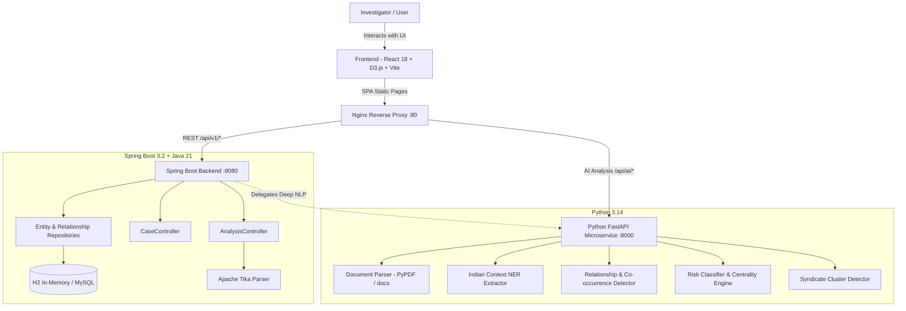

# 🏛️ CrimeNet System Architecture

---

## 🛠️ Technology Stack Breakdown

| Layer | Technologies | Role |
|---|---|---|
| **Presentation** | React 18, Vite, D3.js v7, Zustand, Lucide Icons | Responsive Dark-Mode Intelligence Workstation |
| **Application Layer** | Spring Boot 3.2, Java 21, Spring Data JPA, Springdoc OpenAPI | Persistent case management, transactional data integrity |
| **AI NLP Service** | Python 3.14, FastAPI, Uvicorn, PyPDF, python-docx, Regex | Indian phone formats, vehicle registration NER, syndicate clustering |
| **Persistence** | H2 in-memory (dev) / MySQL compatible (prod) | Entity, relationship, and case storage |
| **Containerization** | Docker, Docker Compose, Nginx Alpine | One-click production deployment across servers |
